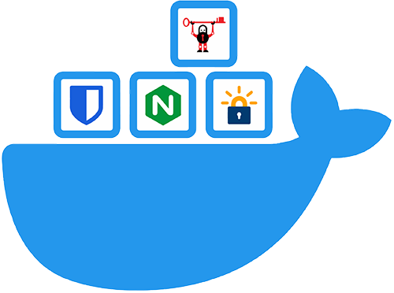

<!-- PROJECT SHIELDS -->


<!-- PROJECT LOGO -->
<br />
<div align="center">
  
  <h3 align="center">docker-nginx-vaultwarden-ssl</h3>
  <br />
  <p align="center">
    A practical way to set up and launch a self-hosted bitwarden instance with automatic SSL certificate creation and renewal using nginx webserver and <a href="https://github.com/dani-garcia/vaultwarden">vaultwarden</a> served with docker.
    <br />
    <br />
    <a href="https://github.com/svenpieper/docker-nginx-vaultwarden-ssl/issues/new?labels=enhancement">Request Feature</a>
    ·
    <a href="https://github.com/svenpieper/docker-nginx-vaultwarden-ssl/issues/new?labels=bug">Report Bug</a>
  </p>
</div>


<!-- TABLE OF CONTENTS -->
<details>
  <summary>Table of contents</summary>
  <ol>
    <li><a href="#about-the-project">About the Project</a></li>
    <li><a href="#prerequisites">Prerequisites</a></li>
    <li><a href="#installation">Installation</a></li>
    <li><a href="#usage">Usage</a></li>
    <li><a href="#recommended-settings">Recommended Settings</a></li>
    <li><a href="#contributing">Contributing</a></li>
    <li><a href="#license">License</a></li>
    <li><a href="#references">References</a></li>
  </ol>
</details>


<!-- ABOUT THE PROJECT -->
## About the project

This repo gives you the possibility to run your own [Bitwarden](https://bitwarden.com/) servers at home or on KVMs. I use the popular Docker image [vaultwarden](https://github.com/dani-garcia/vaultwarden/), a relatively small [docker](https://www.docker.com/) image that even runs on Raspberry Pis with >= 1 GB RAM. All you need is your own domain and a server. If this server is located at home you have to enable portforwarding. More about this in the prerequisites. The setup is very simple: Run the `install.sh` script and the rest is almost done by itself. Since the whole thing is supposed to run over HTTPS, a certificate will be generated via [Lets Encrypt](https://letsencrypt.org/de/) for your domain. As an additional goodie, a cronjob is created on your machine, which checks daily if this certificate is still valid. If not, it will be renewed immediately. Automatically and free of charge. [Nginx](https://www.nginx.com/) serves as reverse proxy.


<!-- PREREQUISITES -->
## Prerequisites

### 1. Install Docker and Docker Compose

#### 1.1. Update and Upgrade
First of all make sure that the system runs the latest version of the software. Run the command:
```bash
sudo apt-get update && sudo apt-get upgrade
```

#### 1.2. Install Docker
Now is time to install Docker! Fortunately, Docker provides a handy install script for that, just run:
```bash
curl -fsSL test.docker.com -o get-docker.sh && sh get-docker.sh
```

#### 1.3. Add a Non-Root User to Docker Group
By default, only users who have administrative privileges (root users) can run containers. If you are not logged in as the root, one option is to use the sudo prefix. However, you could also add your non-root user to the Docker group which will allow it to execute docker commands. The syntax for adding users to the Docker group is:

```bash
sudo usermod -aG docker <your_username>
```

To add the permissions to the current user run:

```bash
sudo usermod -aG docker ${USER}
```

Check it running:

```bash
groups ${USER}
```

Reboot your system to let the changes take effect.

#### 1.4. Install Docker-Compose
Docker-Compose usually gets installed using pip3. For that, we need to have python3 and pip3 installed. If you don't have it installed, you can run the following commands:

Removing old Python versions:

```bash
sudo apt-get remove python*
```

Installing Python 3.10:

```bash
sudo add-apt-repository ppa:deadsnakes/ppa
sudo apt-get update
sudo apt-get install -y libffi-dev libssl-dev
sudo apt install -y python3.10-dev
sudo apt-get install -y python3.10 python3-pip
```

Once python3 and pip3 are installed, we can install Docker-Compose using the following command:

```bash
sudo pip3 install docker-compose
```

#### 1.5. Enable the Docker system service to start your containers on boot
This is a very nice and important addition. With the following command you can configure your system to automatically run the Docker system service, whenever it boots up.

```bash
sudo systemctl enable docker
```
With this in place, containers with a restart policy set to always or unless-stopped will be re-started automatically after a reboot.

#### 1.5.a For WSL users: Enable Docker system start at startup
WSL does not know `systemctl`, so we have to use a different approach to make docker run at startup. Open `~/.profile` and add the following section at the end of the file:

```bash
# make docker run automatically at wsl startup
if service docker status 2>&1 | grep -q "is not running"; then
    wsl.exe -d "${WSL_DISTRO_NAME}" -u root -e /usr/sbin/service docker start >/dev/null 2>&1
fi
```

#### 1.6. Run Hello World Container
The best way to test whether Docker has been set up correctly is to run the Hello World container.
To do so, type in the following command:

```bash
docker run hello-world
```

Once it goes through all the steps, the output should inform you that your installation appears to be working correctly. In addition to that you can also run this command to get the installed docker version:

```bash
docker version
```

#### 1.7. Check Docker Compose Installation
Last but not least, check if Docker Compose is working correctly. To do so, create a file named `docker-compose.helloworld.yml` and fill it with this content:

```yml
version: '3'
services:
    hello-world:
        image: hello-world:latest
```

Then run this hello-world container from the created docker-compose file:

```bash
docker-compose -f docker-compose.helloworld.yml up
```

### 2. Set A Record 

#### 2.1 Get IP of your machine

Get your IPv4 address by visiting [this site](https://whatismyipaddress.com/) or running `curl ifconfig.me`

#### 2.2 Go to your domain vendor and set the A record for your (sub)domain to your local IP

This setting will redirect the call to the domain in a browser or similar to the IP you got earlier. If you are running vaultwarden on a server in your home network, make sure you have port forwarding set for the server's IP and ports 80 and 443. Otherwise your server will only be accessible within your network. Some ISPs do not provide customers with a IPv4 address. It is required for this setup. However, many of these providers offer one upon request.

#### 2.3 Setup DynDNS for your machine

It is not very common for ISPs to offer a fixed IPv4 address. This means that this address is changed at regular intervals. This can happen, for example, when the router is restarted. This means that the A record at your domain provider is no longer valid and is not routed correctly. Therefore we have to ask regularly for the current IPv4 address and renew it at the domain provider. Many of these providers offer an API for this. 

To automate this process you can for example write your own Python script that sends the required HTTP request in case of a change. You can find a simple example in this repo (`/etc/update_dns_record.py`). For privacy reasons I have commented the crucial function only schematically. Here you have to adapt the HTTP request to the API interface of your domain provider.


<!-- INSTALLATION -->
## Installation

So everything is installed so far? Now it is time to start the stack. For this there is the `install.sh` script in this repo. This automates the whole process from creating an init-server for getting the certificates, creating custom configs, to starting the actual vaultwarden and nginx instance. Finally, a cronjob is created which checks daily if the current certificate is still valid. If not, a new one is generated and loaded into the container. Pretty handy, isn't it? It is important that you pass your domain and email address as parameters to the script. Only then letecrypt can generate your certificates and nginx can be configured correctly. It is important to say here again that you must have already set the A record to your IP address at this point and the port forwarding must be set correctly. But here now the command:

```bash
chmod +x install.sh
./install.sh <example.domain.de> <mail@example.de>
```

After the script finishes without errors you should have access to your self-hosted vaultwarden under `example.domain.de`. Create an account there and remember your master password, this is now your access code to the rest of your secure passwords. At this point you should set the Docker environment variable `SIGNUPS_ALLOWED` to `false` and restart the container. You can do this with `docker-compose up -d`. This means that no more people can now create accounts.

If you don't have a fixed IPv4 address you can check it regularly and change your A record if it changes. Many domain providers offer API interfaces to change them via HTTP GET request. I have provided the `update_dns_record.py` script under `etc/` for this. Here you only have to change the URL and the credentials to your needs. After that you can simply start the python script once in the background. It will check every 6 hours if your address has changed and if the change was successful. The logs for this are stored under `/logs`. Please also make sure that you adjust `CURR_IP`, `HOSTNAME`, `APIKEY` and if necessary `INTERVAL_S` in the Python script.

<!-- USAGE -->
## Usage

Visit `example.domain.de`, log in with your password and enjoy your own vaultwarden. Of course, you can also use the [Bitwarden](https://bitwarden.com/de-DE/) [Apps](https://bitwarden.com/de-DE/download/) for Windows, Linux, iOS, Android or Mac to access it on the go without having to use the browser. However, you must refer to your own custom server. To do this, before you log in to the app, go to the settings screen and set the server url to your own domain, `https://example.domain.de`. After that you can log in as usual.

<!-- RECOMMENDED SETTINGS -->
## Recommended settings

Your vaultwarden is up and running and accessible? Great! But I recommend you to change some settings to improve your security a bit or to make the usage more relaxed. Do to so go to the settings within your Bitwarden App installed on your phone.

### Security

- Tresor-Timeout: immediately
- Action when Tresor Timeout: lock
- Activate 2FA
- Clear clipboard: `20` seconds

For the very paranoid: Set `WEB_VAULT_ENABLED` to `false` in the `docker-compose.yml` file and restart the container. This will disable login via a browser. If the subsequent 404 response bugs you, you can also provide your own index.html via `WEB_VAULT_FOLDER`. This will be displayed instead. Make sure you rebuild your container after changing docker environment variables. Just run: `docker-compose up --force-recreate`. While we're at it: Did you set `WEB_VAULT_ENABLED` to `false`? You'd better do it.

### Relaxed stuff

- Activate Fingerprint or FaceID activation for your phone
- Activate Passwort Autofill
- Set up available app extensions

<!-- CONTRIBUTING -->
## Contributing

Contributions are what make the open source community such an amazing place to learn, inspire, and create. Any contributions you make are **greatly appreciated**. 
If you have a suggestion that would make this better, please fork the repo and create a pull request. You can also simply open an issue with the [enhancement](https://github.com/svenpieper/docker-nginx-vaultwarden-ssl/issues/new?labels=enhancement) tag.
Don't forget to give the project a star! Thanks again!

1. Fork the Project
2. Create your Feature Branch (`git checkout -b feature/AmazingFeature`)
3. Commit your Changes (`git commit -m 'Add some AmazingFeature'`)
4. Push to the Branch (`git push origin feature/AmazingFeature`)
5. Open a Pull Request


<!-- LICENSE -->
## License

Distributed under the GNU General Public License. See `LICENSE` for more information.


<!-- REFERENCES -->
## References

- [bitwarden](https://bitwarden.com/)
- [vaultwarden](https://github.com/dani-garcia/vaultwarden/)
- [nginx](https://www.nginx.com/)
- [docker](https://www.docker.com/)
- [Lets Encrypt](https://letsencrypt.org/de/)

